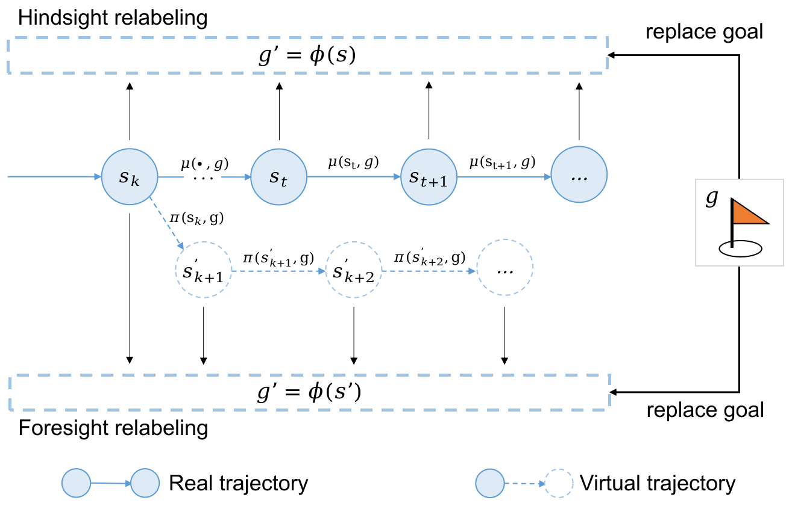

# Robust Model-based Hindsight Experience Replay(RoMo-HER)
Code for Robust Model-based Hindisight Experience Replay (RoMo-HER) is updating. RoMo-HER is a reinforcement learning framework that aims to effectively utilize a model-based goal relabeling technique to improve sample efficiency in robot manipulation environments.

<div style="text-align: center;">

</div>

## Requirements
python3.6+, tensorflow, gym, mujoco, mpi4py

## Installation
- Clone the repo and cd into it:

- Install baselines package
    ```bash
    pip install -e .
    ```


## Usage
Environments: FetchReach-v1, FetchPush-v1, FetchPickAndPlace-v1, FetchSlide-v1.


RoMo-HER
```bash
python -m  romoher.run --env=FetchReach-v1 --num_epoch 30 --num_env 1  --n_step 7 --mode dynamic --alpha 0 --mb_relabeling_ratio 0.8 
```

DDPG:
```bash
python -m  romoher.run  --env=FetchReach-v1 --num_epoch 30 --num_env 1 --no_her True 
```

HER:
```bash
python -m  romoher.run  --env=FetchReach-v1 --num_epoch 30 --num_env 1 
```
