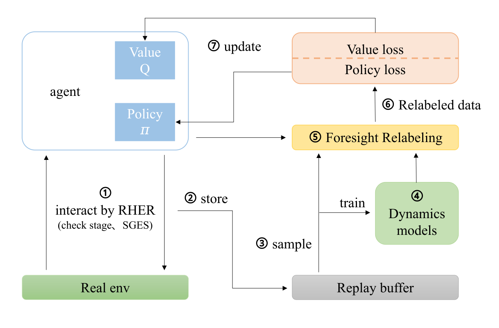
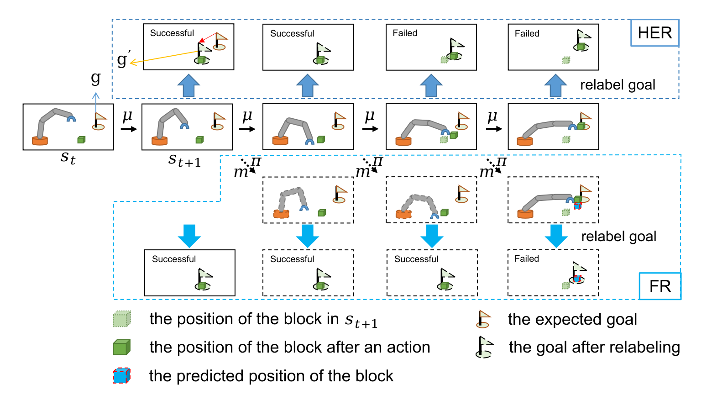

# MRHER: Model-based Relay Hindsight Experience Replay
Code for Model-based Relay Hindsight Experience Replay (MRHER) is updating. MRHER is a reinforcement learning framework that aims to effectively utilize a model-based goal relabeling technique to improve sample efficiency in robot manipulation environments.

# Abstract
Sparse rewards are one of the factors leading to low sample efficiency in goal-conditioned reinforcement learning (RL). Specifically, in sequential manipulation tasks, the agent receives failure rewards until it successfully completes the entire manipulation tasks, which leads to low sample efficiency. To address low sample efficiency, we design a novel model-based RL framework called Model-based Relay Hindsight Experience Replay (MRHER). MRHER introduces Relay Hindsight Experience Replay (RHER) to breaks down a continuous task into subtasks with increasing complexity and utilizes the previous subtask to guide the learning of the subsequent one. Instead of using Hindsight Experience Replay (HER) in every subtask, a new robust model-based relabeling method, called Foresight relabeling (FR), is proposed to predicts the future trajectory of the hindsight state and relabels the expected goal as the goals achieved on the virtual future trajectory. FR works effectively in the object-manipulation environments and allow the agent to learn more information from historical experience for higher sample efficiency. Experimental results demonstrate that the proposed MRHER method exhibits the state-of-the-art sample efficiency in the benchmark tasks, outperforming RHER by 28.13% and 26.26% in  FetchPush-v1 environment and FetchPickandPlace-v1 environment, respectively.

